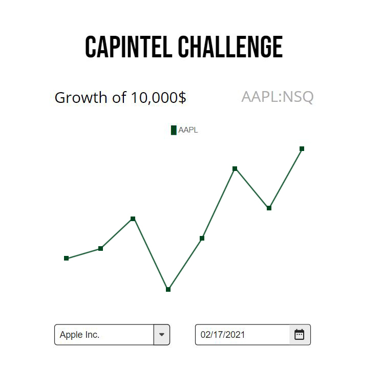

# CapIntel Coding Challenge

👋 Hi there,

Thanks for taking part in this coding challenge!

The goal of this exercise is to assess your base-level knowledge of the React/Redux ecosystem and understand your level of ease in our current stack. We've setup this very generic `create-react-app` template for you to start with, but feel free to add any dependencies you might find relevant.

## Objective

We'd like you to code a small sample app which will perform the following operations:
1. Fetch a sample dataset from a REST API
2. Store the results of that API call within the application state using redux
3. Create a connected component which will display the dataset inside a Highcharts Line Chart
4. Add selection components to view another dataset and change the end date

## Sample Data
You'll find the sample data at this address:
https://challenge.capintel.com/v1/stocks/{ticker}

Where {ticker} is replaced by a stock ticker symbol. The only 3 stocks currently available on this API are the NASDAQ listings of Apple Inc, Amazon.com and Tesla Inc. Just pick whichever stock you'd like to display by default, and then create components to change it for step #4.

The performance data is formatted as a timeseries, with a unix timestamp followed by a percentage growth for that period.

## Line Chart
Using the *Highcharts* library, please graph the hypothetical growth of **10,000$** over a period of **3 years**, using the currently selected stock's performance data.

(We suggest using the *Highcharts React* npm wrapper library, for ease of use)

## 🚀 Completion

Simply zip your repo and send it back to your point of contact at CapIntel. We'll review it and get back to you within a few days.

Thanks for applying!

## Mock-up

Here's a rough mock-up of the base components of the app, please feel free to style it however you like!

